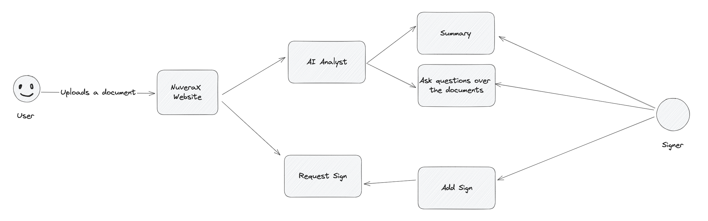

# Introducing NuveraX Documents
### Revolutionizing Learning and Streamlining Signatures

A groundbreaking open-source initiative designed to enhance your learning experience from formal documents and simplify the process of requesting signatures.

Navigating through extensive volumes of information prior to signing a document can undoubtedly be a daunting task. The arduous hours or even days spent meticulously sifting through page after page of complex formal documents can often feel overwhelming. Recognizing this common challenge, we embarked on a mission to provide a transformative solution that empowers individuals in dealing with this issue.

### Navigating through extensive volumes of information prior to signing a document can undoubtedly be a daunting task

The arduous hours or even days spent meticulously sifting through page after page of complex formal documents can often feel overwhelming. Recognizing this common challenge, we embarked on a mission to provide a transformative solution that empowers individuals in dealing with this issue.



Enter NuveraX Documents, a cutting-edge platform meticulously crafted to elevate your learning journey and streamline the signature acquisition process. Our vision is simple yet impactful: to revolutionize the way people approach information assimilation and signing procedures.

### Through NuveraX Documents, we are poised to:

- **Accelerate Learning:** Digesting extensive content will no longer be a time-consuming ordeal. Our platform employs innovative techniques that facilitate faster comprehension of complex materials. Say goodbye to the frustration of poring over endless pages.
- **Simplify Signatures:** Obtaining signatures is no longer a cumbersome chore. NuveraX Documents introduces an intuitive and efficient approach to sending and receiving signature requests. Experience a seamless process that saves you both time and effort.
- **Empower Individuals:** Our project is rooted in the belief that knowledge is meant to be accessible. By democratizing access to information and simplifying intricate procedures, we empower individuals to confidently navigate through formal documents and secure signatures without hesitation.

Imagine a world where learning from documents becomes an effortless endeavor, and securing signatures is a breeze. NuveraX Documents paves the way for just that. Join us in embracing a future where information is your ally, and signatures are obtained with unparalleled ease.

> Experience NuveraX Documents – where learning meets efficiency, and signatures are acquired without the fuss. Welcome to a new era of streamlined processes and enhanced productivity.

## Features
- 💯 Free and open-source.
- AI analyst for documents.
- Create summaries.
- Sign documents.
- Request signing.
- And many, many more.

> Note: We are still working to get a MVP [here you can see a concept](https://nuverax-dev.web.app/).

## Quick start

```
git clone https://github.com/lfernando2091/nuverax.git
npm install
npm start
```

## Contributing
- Missing something or found a bug? [Report here](https://github.com/lfernando2091/nuverax/issues).
- Want to contribute? Check out our [contribution guide](https://github.com/lfernando2091/nuverax/blob/main/CONTRIBUTION.md)

